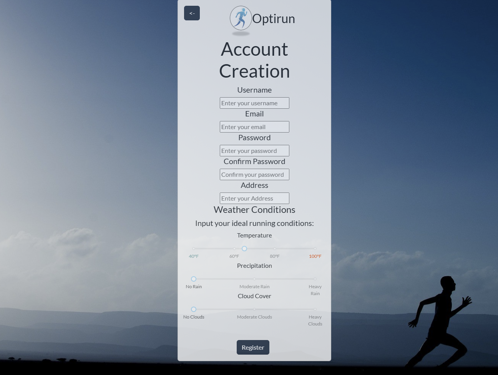
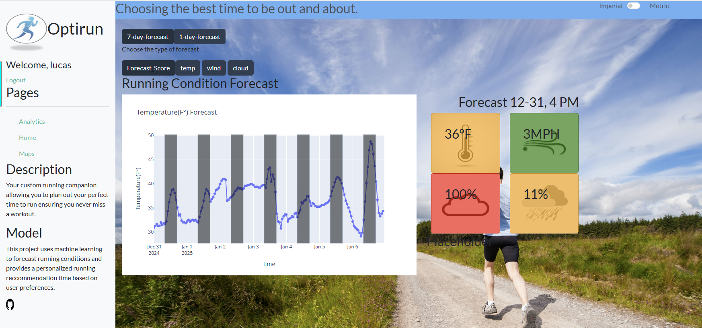

## Running Condition Forecasting with Optirun
Optirun uses open source weather forecast and user preferences to identify the optimal time to go for a run. A LLM is then incorporated to provide additional context to the running forecast in plain english.

### Components

* Weather Forecast from OpenMeteo: https://github.com/m0rp43us/openmeteopy
* User preferences stored in PostgreSQL Database
* Front end Dash appplication Deployed on Render: https://render.com/
* Weather interpreter using Anthropics Claude

### Login and Registration

Login using Flask and our PostgreSQL database to authenticate user, load preferences, and generate forecasts for their location and preferences.

Registration allowing each user to specify their unique preferences for running conditions.

Forecasts weather conditions over the next week alloying user to evaluate both upcoming weather and the overall running score based on their preferences. KPI indicator offers green/orange/red classification based on difference between forecasted value and users preferred.

### Deployment

Both the front end dash application and back end PostgreSQL database are deployed on render.

Live application: https://optirun-jb9t.onrender.com
